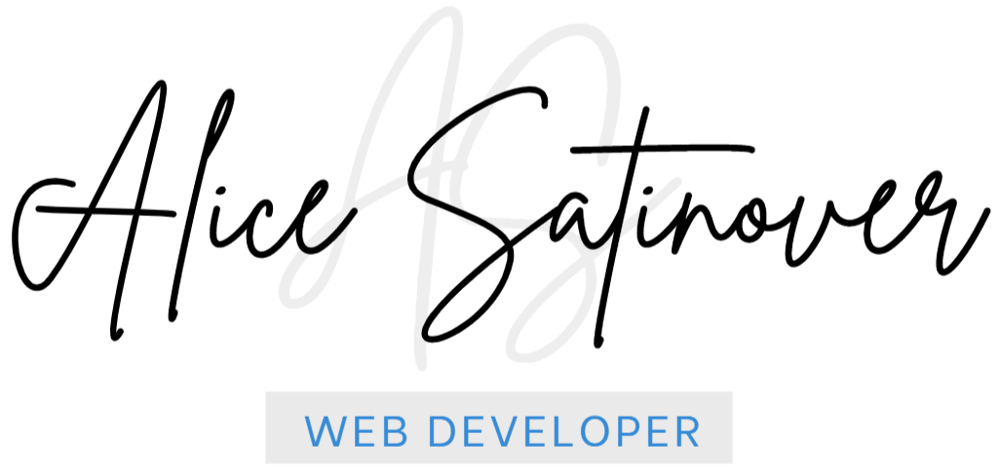
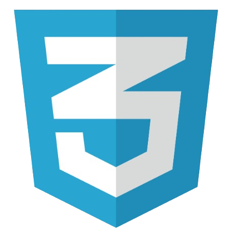

## Hello I'm 👋

 
As a full-stack software developer with expertise in both front-end and back-end technologies, my passion lies in crafting modern, user-friendly software solutions that deliver exceptional user experiences. I love designing, engineering, and implementing innovative solutions that drive success and efficiency. With a decade-long career in the healthcare industry, I bring valuable transferable skills, such as problem-solving, attention to detail, and a deep understanding of user needs. This background enriches my approach to software development, allowing me to create solutions that are not only technically robust but also empathetic to the user experience.
 
 
In my current role in higher education, I focus on front-end technologies, web development, design, user experience (UX), and accessibility. My work involves creating inclusive and engaging digital experiences that align with institutional goals and user needs. I also specialize in WordPress development, leveraging it to build scalable, accessible, and visually appealing websites that enhance usability and performance across diverse audiences.
 
 
≻────── ⋆✩⋆    LANGUAGE & TOOLS   ⋆✩⋆ ─────≺

 
 

<!--
**AliceSatinover/AliceSatinover** is a ✨ _special_ ✨ repository because its `README.md` (this file) appears on your GitHub profile.

Here are some ideas to get you started:

- 🔭 I’m currently working on ...
- 🌱 I’m currently learning ...
- 👯 I’m looking to collaborate on ...
- 🤔 I’m looking for help with ...
- 💬 Ask me about ...
- 📫 How to reach me: ...
- 😄 Pronouns: ...
- ⚡ Fun fact: ...
-->
